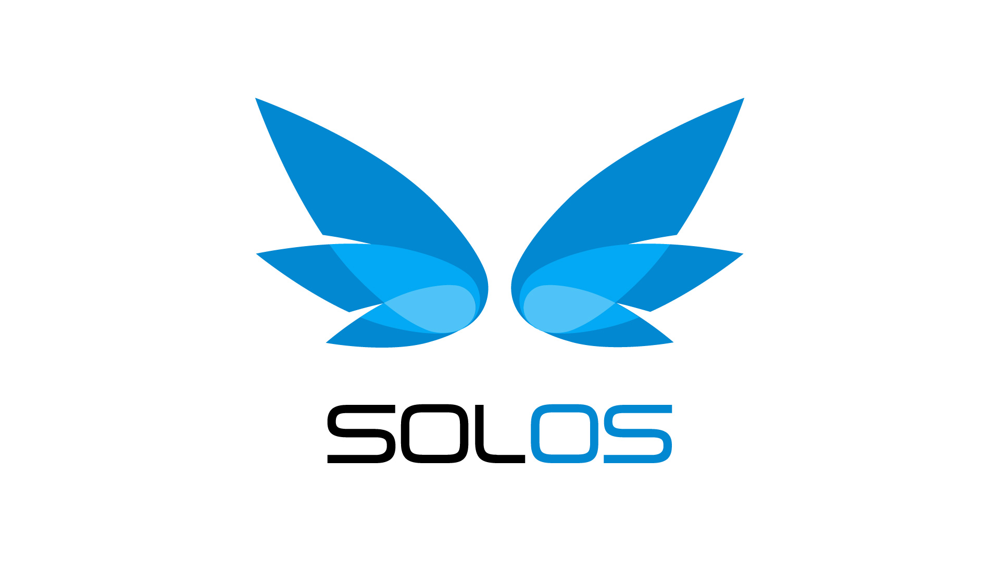

# solOS – Операционная Система для вашего бизнеса 

Этот репозиторий содержит набор примеров и скриптов, разработанных для работы с платформой [solOS](https://www.solos.pro/).

Данный репозиторий создан для того, чтобы помочь разработчикам быстрее начать интеграцию с [API](https://www.solos.pro/api/v1/) платформы и не только.

## Лицензия

Этот репозиторий распространяется под лицензией MIT. Подробнее читайте в файле [LICENSE](LICENSE).
